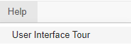
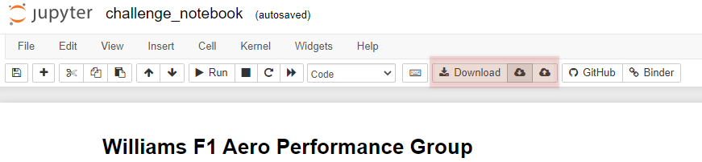

# 2022 Industrial Placement Challenge 
An online jupyter notebook environment using the Octave coding language for use in solving the 2022 Industrial Placement Challenge.

## Getting Started 
To launch the environment, click the button below. It will take a few minutes to fire up a fresh session, but after it finishes loading you will be presented with a jupyter notebook environment and the coding challenge. 

## Instructions 
Follow the instruction in the notebook for each of the tasks provided. A sample cell is filled in showing one way to load the data from the online environment. 

* Task 1 : using the measured accelerations, reconstruct the trajectory of the car in the horizontal plane to be able to plot the map of the track, the racing line
* Task 2 : with the channel provided, calculate and plot against “slap” the normalized coefficients of front and rear downforce assuming a reference area of 1 m^2
* Task 3 : calculate the total downforce and aero balance and plot against “slap”
* Task 4 : plot a view of the racing line coloured in red for the part of the lap where the driver is “grip limited” and blue where the driver is “power limited”
* Task 5 : derived from the previous work an average value for the “power limited” drag and the “grip limited” total downforce
* Task 6 : from the above calculate the aerodynamic efficiency of this car

**Rules:**
* We expect your will return the plots and results but together with the line of code you used to generate them, with enough comments to explain your method
* There is no time limit, the test should take you approximately 2 hours to complete, but we await you results on Monday 29.12.2021
* We will not judge on the results only, if something does not work, you will still get point for explaining the method you would have wanted to use
* This email should have everything you need, and more. No other information will be given until we received your results.

### Completing the Notebook
You can structure the notebook however you see fit. Just make sure it is logically organized and has enough comments to explain your code and methods. 

### Downloading Notebook for Submission 
Once you have completed your notebook, you can download a copy to submit via the download button. See [Saving/Loading](#savingloading)

## How to Basics 
If you are unfamiliar with the jupyter notebook interface you can get a quick tour via the help menu as shown below

### Saving/Loading 
Because the notebook environment is generated from scratch when you launch the link, it is important to save your work regularly, and download work in-progress copies of your notebook to make sure you don't lose your work. 

The image below shows the save/load/download controls highlighted in orange. 

1. Download - Downloads a copy of your whole notebook. This is what you will need to use when you want to get a copy of your notebook to submit. 
2. Save - This will save your current work into your browsers storage. If your session times out or you need to close your browser and come back later, you can use this option. 
3. Load - If you have saved work in your browsers storage you can use this option to restore your notebook back to that point. 

## Resources 
* https://octave.org/doc/v6.4.0/
* https://jupyter-notebook.readthedocs.io/en/stable/
  
